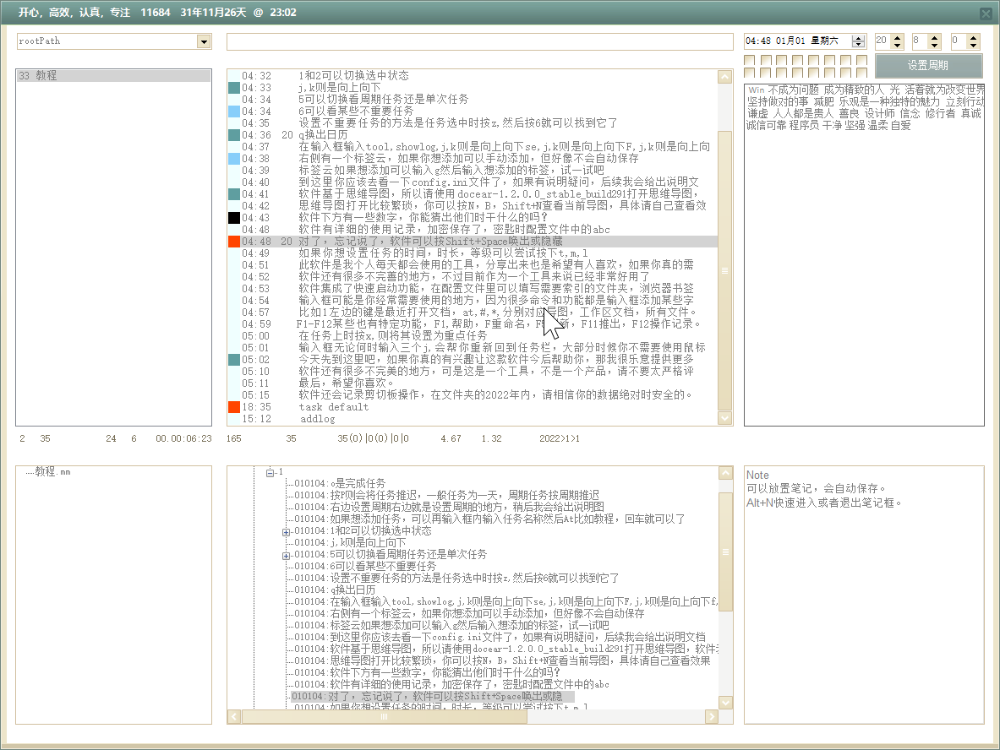
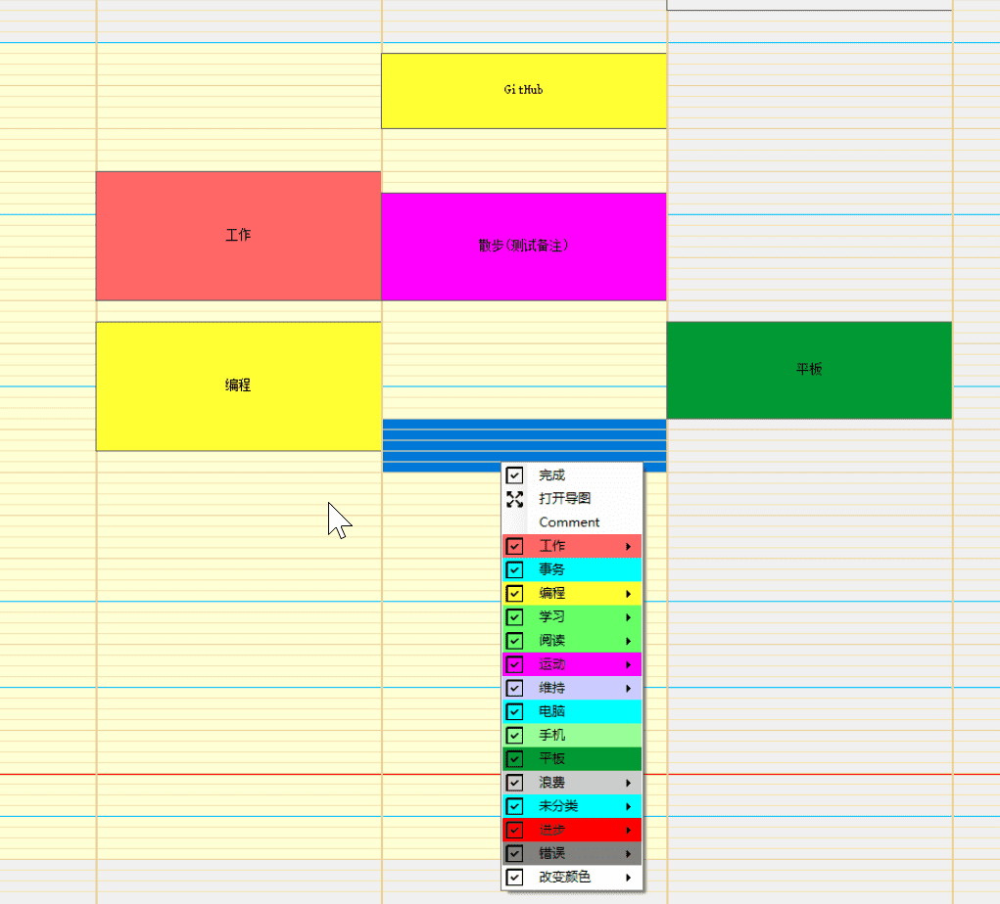
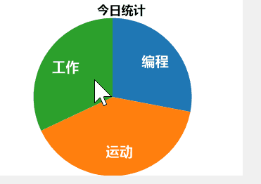

# DocearReminder

Docear思维导图软件，在使用过程中，发现提醒功能只能在思维导图打开后才能提示。所以就写了一个工具在导图中寻找提醒任务，这就是这款软件的由来，而自从有了这款软件之后，我打开思维导图的次数少了很多。

这是一款能让思维导图更加系统化的工具，它集成了任务管理，番茄钟，日历视图，快速启动，文件检索，浏览器书签搜索，剪切板备份等诸多功能，它拥有相当详尽且加密的操作历史记录，积分奖励算法（比如完成一个任务加积分，取消或者推迟任务有扣分等），使用时间统计（总的使用时间，当日使用时间）。
***
* 日历管理：导图中的任务可以方便的完成或者修改时间，设置周期等。（支持，日，周，小时，年周期）
* 番茄钟：打开番茄钟的时候更容易专注于当下处理的工作。
* 日历视图：方便检视最近的安排。
* 快速启动：开始菜单，Claunch软件，设置某个文件夹的内容都可以在输入框输入关键字打开。
* 文件夹检索：设置某些文件夹，可以快速搜索里面的文件。
* 浏览器书签：只是chrome内核浏览器的书签检索和打开，标题和网址都能检索到。（config.ini文件的配置希望你能看懂）
* 剪切板：记录所有剪切板记录，图片，如果使用工具添加网址内容，网址会转换成网页标题添加到导图中，并在剪切板文件夹中存储该网页的html内容，以防止网页消失的可能。
* 思维导图快浏览：按N打开思维导图，按B打开思维导图节点，Shift+n则隐藏导图书。支持删除delete,重命名，设置任务（Control+enter）
* 支持多个电脑：配置文件中有电脑名开头的变量，可以设置。
* 理财管理：可以很方便记录花了多少钱（模板没有放进压缩包，后续介绍）
* 文件管理：导图系统中的文件，可以在软件中浏览，删除，重命名。
* 思维导图检索:思维导图中的任何节点在软件中都可以搜索到，在输入框输入*然后搜索，#开头搜索导图系统中所有文件,!开头，~开头。。。。大家先自己研究
* 可以快速在导图中添加任务：比如：输入task@教程。如果教程下有个节点node1设置了图标，或者是已经完成的任务，可以输入task1@@node1在该节点下添加内容。（这也是经常用的功能），有图标节点的信息会在软件加载时搜索，如果是新添加的，则输入allicons,则会重新检索图标节点。mindmaps命令用于更新导图文件提示，即@ 符号后面的提示。
* 详尽的软件使用记录，会记录你添加，完成，推迟的记录，当然这是加密的，加密密匙是config.ini中的abc,正式使用前可以更改成自己的。详细的软件使用记录，打开关闭时间，记录总的使用时长，当日使用时长。后续计划对json文件的记录用图表展示，目前还不需要。
* 熟练使用后软件实际使用中基本用不到鼠标，不过近一个月考虑到要分享出来的计划，添加了一些右键菜单。图标没有加，有些也没有填内容，如果遇到右键不能用的勿怪。
* 因为开始写这个软件的时候只想写个小工具，没想弄这么复杂，所以采用了winfrom写的，后续想改成wpf已经比较困难了，所以界面美化的问题一直是这样，当然也有我设计水平一般的原因吧，希望用习惯就好。
* 推荐使用Git备份自己的思维导图系统，输入ga会帮你添加新文件，注释@gc则会帮助你提交.
* 按F1可以打开帮助文档。
***
软件属于个人工具的分享，许多个周六周日敲了一万多行代码才有了这款软件，分享出来希望它帮助更多人过上更加有秩序，有效率的生活。

软件使用方法我已经设置了任务，唯一需要给首次使用者提醒的是软件可以Shift+Space唤出或隐藏界面。Alt+Space显示日历窗口。
***

## 更新记录

### 3月4日更新：

1. 添加皮肤功能
2. 日历添加时间块功能
3. 基于GitHub的更新（网络不好肯能导致更新失败）
4. 语音控制功能
5. 记录键盘，文件操作日志
6. 鼠标控制键（按住Alt+   j ,k,u,l,u,o等键）

### 六月更新
1. 图表

## [开发思维导图](DocearReminder.mm)

# 软件截图

### 主窗口

### 日历窗口

### 添加时间块

### 日志窗口

### 剪切板窗口

### 番茄钟

### 统计模块

